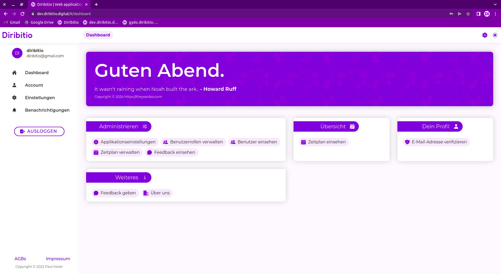
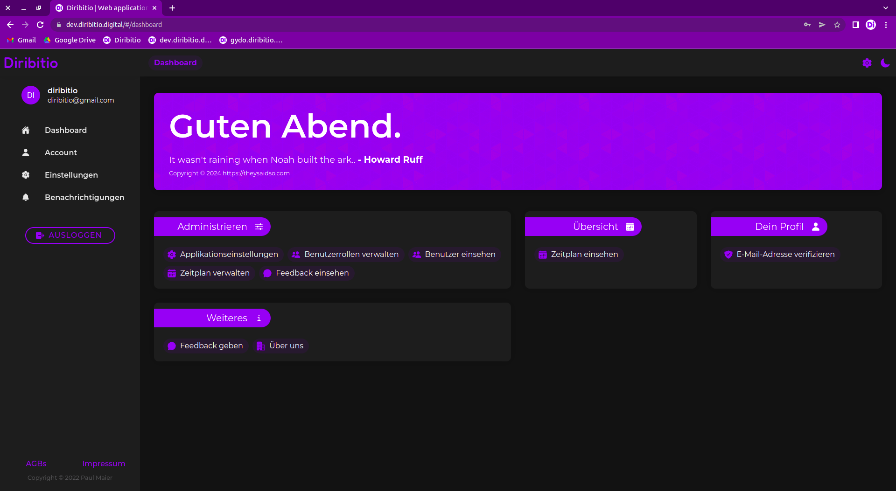
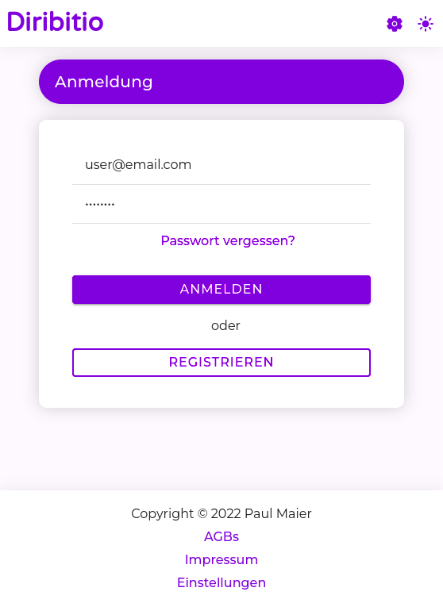

# Diribitio

Diribitio is a SaaS project I worked on personally as a student until 2022. The aim of my project was to support the organization of the project days at our school by means of a software in such a way that primarily the administrative workload and time expenditure can be reduced. The software should facilitate the assignment of the students to the projects, since this is still done manually. Furthermore, it should also solve problems such as insufficient communication. The application was never actually put into operation, however the project was deployed on a staging server twice.

## Jugend forscht

The first version of the project was submitted to [Jugend forscht](https://www.jugend-forscht.de/), which is a science competition for students in Germany. The project was awarded the 2nd place in the category "Arbeitswelt" (workplace) at the "Regionalwettbewerb München West" (regional competition Munich West) in 2021. The paper (only in German) can be found in this repository (see `Diribitio - Schriftliche Ausarbeitung.pdf`).

## Structure

The code is divided over multiple repositories:

- `inpriparo` contains the code for the backend, which is written in PHP using the Laravel framework.
- `vnint` contains the code for the frontend, which is written in TypeScript using the Angular framework.
- `raspredo` contains the code for the algorithm which was supposed to allocate the students to the projects. It is written in Python, but is not yet functional.
- `deployment` contains the configuration files for the deployment of the application using Docker and Docker Compose.

Additionally there are two repositories for the frontend and backend of the first version (which was submitted to Jugend forscht) of the project:

- `diribitio-backend` contains the the original backend code, which is written in PHP using the Laravel framework.
- `diribitio-frontend` contains the original frontend code, written in TypeScript using the Angular framework.

## Concluding remarks

Even though the project was never deployed into production, I am still very much proud of what I achieved (considering I did all of this in grade 8 to 10). I had a lot of fun building the application and also learned a lot while doing so. For me it will always be a special project since it was the first big project I worked on and it marks a very important step in my live and helped me to get into software development and computer science in general. It's probably fair to say that I wouldn't be where I am today without this project.

## Screenshots

The frontend (Vnint) in light mode.

The frontend (Vnint) in dark mode.

The frontend (Vnint) in light mode for mobile devices.
